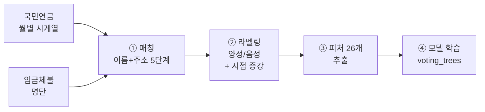
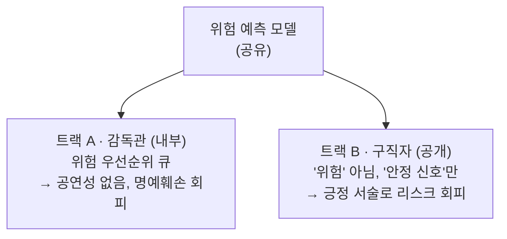
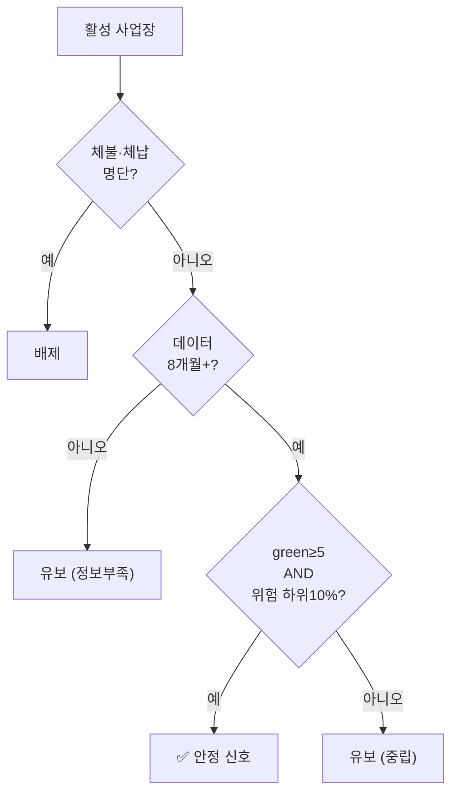

# 돈워리 · WageGuard-AI
## 국민연금 데이터 기반 임금체불 위험 예측 & 안전 추천 — 발표 자료

> **한 줄 요약** — 국민연금 가입 사업장 시계열로 **임금체불 명단공개 위험을 6개월 앞서 예측**하고, 이를 **감독관(위험 우선순위)**과 **구직자(안전 신호)** 두 사용자에게 법적 리스크 없이 서로 다르게 제공하는 시스템.

📷 **[표지 이미지]** — 서비스 로고/대시보드 히어로 스크린샷 (`demonstration/안전추천_서비스_데모.html` 캡처) 삽입 권장.

---

## 0. 한눈에 보기 (Executive Summary)

| 항목 | 내용 |
|---|---|
| **문제** | 근로감독 인력은 한정, 임금체불은 사후 적발 → **사전 예측**으로 선제 대응 필요 |
| **데이터** | 국민연금 가입 사업장내역 71개월(2020-06~2026-04), 활성 **552,500 사업장** |
| **핵심 모델** | voting_trees 앙상블(LightGBM 5-seed + CatBoost), ROC-AUC **0.65**, Precision@10 **0.82~0.88** |
| **트랙 A (감독관)** | 위험 우선순위 큐 — 상위 10% 점검 시 **무작위 대비 2.8배** 많은 체불 사업장 포착 |
| **트랙 B (구직자)** | 안전 추천 — **35,549개** 사업장(6.4%)에 안정 신호, 알려진 체불의 **89%를 게이트가 차단** |
| **차별점** | ① 법적 리스크(명예훼손) 선제 대응한 2-트랙 설계 ② 반증 검증으로 자체 버그 3건 발견·수정 |

### 개발 여정 (초기 → 현재)


---

## 1. 문제 정의 & 배경

- **임금체불**은 근로자 생계를 위협하고, 심하면 정부가 **명단공개**(사업주 명단 공표)를 합니다.
- 그러나 **적발은 사후적**이고, 근로감독관 인력은 한정되어 있습니다.
- **핵심 질문**: *"국민연금 데이터만으로 어떤 사업장이 앞으로 6개월 안에 임금체불 명단공개될지 미리 알 수 있을까?"*

**왜 국민연금 데이터인가**
- 임금체불이 임박한 사업장은 **붕괴 전 신호**를 남깁니다 — 가입자(직원) 급감, 보험료(인건비) 하락, 데이터에서 사라짐(탈퇴).
- 국민연금 월별 스냅샷은 이 신호를 시계열로 담고 있습니다.

📷 **[이미지: 문제 개념도]** — "정상 → 신호 발생 → 명단공개" 타임라인 일러스트 (선택).

---

## 2. 데이터 — 출처·규모·특성

### 2.1 사용 데이터 (좋은 소식)

| 데이터           | 출처           | 규모                                     |
| ------------- | ------------ | -------------------------------------- |
| 국민연금 가입 사업장내역 | 국민연금공단 공공데이터 | **71개월** (2020-06~2026-04), 월 ~60만 사업장 |
| 임금체불 명단공개     | 고용노동부        | **793건** (2023-1차 ~ 2026-1차)           |
| 건강보험 체납 공개명단  | 건강보험공단 (크롤)  | **3,493건** (고액·상습 법인)                  |
| 산업 폐업률        | KOSIS 업종매핑   | KSIC 대분류별                              |

### 2.2 초기 → 확장 (이번 고도화에서 한 것)
- **명단 확장**: `606건 → 793건` (신규 회차 **2026년 1차 187건** 추가 — requests 기반 크롤러 신규 작성).
- **국민연금 파일명 통일**: 공개일 기준 → **자료생성년월 기준**으로 재라벨링(데이터 정합성 확보).
- **파이프라인 재빌드**: 2026-1차 반영, 범주형 'NA' 버그 수정 → 학습셋 **876건** 재생성.

### 2.3 ⚠️ 중요한 데이터 특성 (발표 시 반드시 언급)
- 국민연금의 단위는 **회사가 아니라 "사업장(establishment)"** — 한 회사가 여러 사업장을 가짐(예: 위탁사 1곳 → 아파트관리소 수백 개).
- **사업자등록번호가 6자리로 마스킹** → 고유값 32,241개뿐(세무서+구분 프리픽스). **번호는 식별자가 아니며, 실질 키는 사업장명**.
- → 이 때문에 **이름+주소 5단계 매칭**을 사용(단순 번호 조인 불가).

---
## 4. [트랙 A] 위험 예측 파이프라인



### 4.1 매칭 (Entity Resolution)
사업자번호가 6자리라 무력 → **정규화 이름 + 주소(시군구/시도) 5단계 매칭**:

| 단계 | 조건 | 비고 |
|---|---|---|
| 1 | 이름 완전일치 + 시군구 | 가장 엄격 |
| 2 | 이름 완전일치 + 시도 | |
| 3 | 이름 부분일치(≥4자) + 시군구 | |
| (4) | 이름 부분일치 + 시도 | **오탐 위험 → 미채택** |
| 5 | 이름 완전일치 + 후보 ≤3 | |

→ 명단 793건 중 국민연금에 **758건 매칭**.

### 4.2 라벨링 & 데이터 증강
- **양성**: 임금체불 명단공개된 사업장 (커버리지 필터 통과 **94개 고유**).
- **시점 augmentation**: 양성 1개당 shift(−2~+2) **×5 = 438개**.
- **음성**: 무작위 정상 사업장 **438개** (1:1 다운샘플링).
- **왜 1:1?** 실제는 극단적 불균형(수백:수백만) → 그냥 두면 모델이 "전부 안전"이라 찍음. **균형을 맞춰 희귀 위험을 학습하도록 강제**.
- 최종 학습셋 **876건**.

### 4.3 입력 피처 26개 (`[t-18, t-6]` 13개월 창)
| 그룹 | 대표 피처 | 포착 신호 |
|---|---|---|
| 시계열 (고용) | 가입자 3/6/12개월 변화, 고용 변동성 | 인력 급감 |
| 시계열 (인건비) | 1인당 인건비 평균·변화·연속하락 | 임금 삭감 |
| 시계열 (이직) | 이직률 평균·최대·가속 | 이탈 |
| 정적 | 업력, 규모, 업종 폐업률, 지역 | 신생·영세·고위험업종 |
| **결측 패턴** | **최근 3개월 결측, 결측 개월수·비율** | **탈퇴 임박 (핵심)** |

📷 **[이미지: 피처 설계도]** — `visualization/입력변수_설계` 관련 도식 또는 27개 피처 그룹 다이어그램.

### 4.4 모델 선택 — 여러 후보 비교 (GroupKFold 25 folds)
| 모델 | ROC-AUC | Precision@10 |
|---|---|---|
| Logistic Regression | 0.621 | 0.720 |
| LightGBM (단일) | 0.636 | 0.740 |
| CatBoost | 0.604 | 0.672 |
| LightGBM 5-seed | 0.644 | 0.748 |
| **voting_trees (채택)** | **0.652** ★ | 0.820 |
| voting_weighted | 0.644 | 0.880 |

→ **채택: voting_trees** = `0.5×(LightGBM 5-seed 평균) + 0.5×CatBoost`. AUC 최고 + 트리 모델만이라 배포 안전(범주형 처리) + 체납 게이트 최고.

---

## 5. [트랙 A] 위험 모델 결과 & SHAP 인사이트

### 5.1 성능
- **ROC-AUC ~0.65**, **Precision@10 0.82** (교차검증).
- 실배포(552,500 사업장) 검증 — **위험 상위 K%에 실제 체불이 몰리는 배율(lift)**:

```
위험 상위 1%   ██████████████████  6.06×   ← 무작위 대비 6배
위험 상위 5%   ████████▋           2.88×
위험 상위 10%  ████████▍           2.80×   (전체 체불의 28% 포착)
위험 상위 30%  ██████▌             2.15×   (전체 체불의 64% 포착)
```
→ **상위 10%만 점검해도 무작위 점검보다 2.8배 효율.** 한정된 감독 인력 배분에 직접 기여.

📷 **[이미지: Precision@K 헤드라인 차트]** — `visualization/fig01_헤드라인_Precision10.png` 삽입.
![[fig01_헤드라인_Precision10.png]]

### 5.2 SHAP — "무엇이 위험을 결정하나"
- **1위 신호 = 최근 결측(탈퇴 임박)** — 체불 직전 사업장이 국민연금에서 빠져나가는 패턴.
- 이어서 **가입자 감소, 인건비 하락, 짧은 업력, 이직 급증**.

📷 **[이미지: SHAP 요약 플롯]** — `model/outputs/shap_summary.png` (피처별 영향 분포, beeswarm) 삽입.
![[shap_summary.png]]
📷 **[이미지: 피처 중요도 막대]** — `model/outputs/shap_summary_bar.png` 삽입.
![[shap_summary_bar 1.png]]
### 5.3 사업장별 설명 (서비스에 탑재)
개별 사업장의 위험을 **SHAP 기여도로 분해** → 감독관이 "왜 이 사업장이 위험한지" 즉시 파악.
> 예) 주일섬유(주): 관측 결측 7개월 `+1.26` · 이직률 `+0.27` · … → 위험점수 0.97

📷 **[이미지: SHAP 상세 모달]** — 데모의 감독관 사업장 클릭 시 뜨는 SHAP 패널 스크린샷.

---
## 3. 접근 전략 — 왜 두 갈래(2-트랙)인가

### 3.1 법적 리스크 (핵심 설계 근거)
아직 체불하지 않은 사업장을 공개적으로 **"위험"이라 경고**하면, 사실이라도 **형법 제307조(사실적시 명예훼손)** 소지가 있습니다.

### 3.2 해결 — 사용자별 분리


| | 감독관 (내부) | 구직자 (공개) |
|---|---|---|
| 출력 | 위험 top-K 우선순위 | 안정 신호 관찰된 곳만 |
| 표현 | "위험" (행정용) | "안정" (긍정 서술) |
| 위험점수 | 노출 | **비노출** |
| 법적 위험 | 낮음(내부) | 설계로 최소화 |

### 3.3 핵심 통찰 — "안전 ≠ 위험의 반대"
- 임금체불 명단공개는 **극히 희귀** → 모델은 **위험 상위 tail엔 강하지만, 안전 보증엔 약함**.
- "곧 망할 회사"도 붕괴 직전까진 정상 회사와 데이터상 거의 동일 → **"안전"이라는 양성 지문이 없음**.
- 그래서 안전추천은 **"보장"이 아니라 "참고용 관찰 신호 + 알려진 위험 배제"**로 포지셔닝.
## 6. [트랙 B] 안전 추천 시스템

### 6.1 왜 "예측"이 아니라 "관찰"인가
- 구직자에겐 확률 예측 대신 **국민연금에서 실제 관찰된 안정 사실**을 서술.
- *"AI가 안전하다고 예측"*보다 *"최근 1년 고용 안정 + 명단에 없음"*이 **법적으로·투명성으로 우월**.

### 6.2 안정 지표 6개 (green flag) — 최근 12개월 관찰
|     | 지표    | green 조건               |
| --- | ----- | ---------------------- |
| G1  | 고용안정  | 가입자 첫달 대비 −5% 초과 감소 없음 |
| G2  | 성실납부  | 12개월 결측 0 (매월 데이터 존재)  |
| G3  | 인건비안정 | 1인당 인건비 −5% 초과 하락 없음   |
| G4  | 인력유지  | 누적 신규 ≥ 누적 상실          |
| G5  | 업력3년  | 가입 후 3년 이상             |
| G6  | 낮은변동성 | 가입자 변동계수 ≤ 0.15        |

### 6.3 배제 필터 — 알려진 나쁜 곳 제거
- **임금체불 명단** + **건강보험 체납 명단**에 있으면 → 안정 신호에서 **완전 배제**.
- 매칭: **exact 키 + 5단계(이름+주소)** → 체불 **146**, 체납 **1,219** (활성 기준).

### 6.4 3+2 상태 게이트

- **"유보"는 명시적 중립** — "안전 목록에 없음 = 위험" 암시(누락에 의한 명예훼손) 차단.

---

## 7. [트랙 B] 안전 추천 결과 & 검증

### 7.1 판정 분포 (활성 552,500)
```
안정신호        ███▏                         35,549  (6.4%)
유보           ██████████████████████████████████████  449,653  (81.4%)
유보_정보부족   █████▉                       65,934  (11.9%)
배제_공개체납    ▏                            1,218  (0.2%)
배제_임금체불    ·                              146  (0.03%)
```

📷 **[이미지: 안전 판정 분포]** — `safe_recommendation/outputs/fig_safe_recommendation_v2.png` 삽입.
![[fig_safe_recommendation_v2.png]]
### 7.2 게이트 검증 — 알려진 나쁜 곳을 얼마나 거르나 (clean 라벨)
```
                 게이트 통과(false-safe)      기저(무작위)
알려진 임금체불    ▏ 0.68%                     ████ 6.44%     → 89% 차단
알려진 체납        ██ 3.20%                    ████ 6.44%     → 50% 차단
```
→ **알려진 체불 사업장 146개 중 단 1개만** 안전 신호로 새어나감(무작위의 1/9 수준).

### 7.3 안정 신호 사업장의 green flag 충족률
```
고용안정   ████████████████████ 97.2%
인건비안정 ███████████████████▍ 96.2%
낮은변동성 ███████████████████  94.8%
인력유지   ██████████████████▉  94.3%
성실납부   ██████████████████▊  93.9%
업력3년    █████████████████▍   87.0%
```

📷 **[이미지: 구직자 안전 카드]** — 데모의 구직자 뷰(6개 green flag 체크 카드) 스크린샷.

---

## 8. 엄밀성 — 발견하고 고친 문제들 (투명성 어필)

> 발표 포인트: *"화려한 성능보다, 우리 결과를 우리가 반증하며 검증했다"* — 자체 반증 검증으로 **3건의 실제 버그**를 발견·수정.

| #   | 버그                 | 증상                                           | 수정               |
| --- | ------------------ | -------------------------------------------- | ---------------- |
| 1   | **입력창 off-by-one** | 12개월만 수집 → 첫 달 결측으로 상위 피처가 전 사업장 상수 0으로 "죽음" | 13개월 창으로 교정      |
| 2   | **배제 필터 과잉매칭**     | 이름만 매칭 → 배제 7배 부풀림(146→1,052), 검증 라벨 85% 오염  | exact 키 + 5단계 매칭 |
| 3   | **범주형 타입 불일치**     | 지역코드 int/str 불일치로 모델이 지역 피처 무시               | 문자열로 통일·재학습      |

**핵심 교훈 (발표 시 강조)**: 버그 2·3 때문에 한때 *"안전추천이 근본적으로 약하다"*는 잘못된 결론을 냈으나, **깨끗한 라벨로 재측정하니 게이트가 실제로는 강했음**(false-safe 0.95→**0.11**). → *"측정을 의심하고 재검증하는 태도"*가 만든 반전.

📷 **[이미지: Before→After 비교 차트]** — false-safe 0.95→0.11, 큐 lift 1.76→2.80 대비 막대(선택, 직접 생성 가능).

---

## 9. 서비스 데모 (프로토타입)

`demonstration/안전추천_서비스_데모.html` — 실데이터 기반 인터랙티브 대시보드.

- **감독관 뷰**: 위험 우선순위 큐 + **사업장 클릭 시 SHAP 상세**("왜 지금 위험한가"). "내부 전용" 배너로 법적 설계 시각화.
- **구직자 뷰**: 안정 신호 카드(green flag 6개) + "미래 보증 아님" 면책. 위험점수 **비노출**.
- 라이트/다크 테마, 검색, 반응형.

📷 **[이미지: 데모 전체 화면 2장]** — ① 감독관 위험큐 + SHAP 모달, ② 구직자 안전 카드. (좌우 배치 권장)

---

## 10. 한계 & 향후 계획

**정직한 한계**
1. **검증 표본이 작고 낙관 편향** — 활성 상태의 알려진 체불 146개(생존자·학습 겹침) → 실제는 이보다 다소 낮을 것.
2. **진짜 out-of-sample 사후검증 부재** — 추천 후 실제로 명단공개 되는지는 향후 회차가 쌓여야 검증.
3. **"안전"의 근본적 약함** — 희귀 사건의 부재라 신호가 흐림 → "정밀 보장" 아닌 "참고 신호".
4. **양성 라벨 희소** — 고유 94개.

**향후 (본선)**
- Solar LLM 연동(위험 사유·안정 신호의 자연어 브리핑).
- 외부 라벨 결합, 산업 수준 외부 검증, lead-time 3개월 모델.
- peer(업종×규모) 상대평가로 업종/규모 편향 완화.

---

## 11. 결론

- 국민연금 데이터만으로 **임금체불 위험을 6개월 앞서 랭킹**할 수 있음을 입증(상위 10% = 무작위 2.8배).
- **법적 리스크를 선제적으로 설계**해 감독관·구직자 두 사용자에게 안전하게 제공.
- **자체 반증 검증으로 버그를 잡아내는 엄밀성** — 성능 수치보다 신뢰를 만드는 과정.

> **돈워리 — "당신의 일터, 미리 지켜드립니다."**

📷 **[이미지: 마무리 슬라이드]** — 로고 + 슬로건 + 팀명.

---

### 부록 A. 산출물·코드 지도
| 구분 | 위치 |
|---|---|
| 위험 모델 | `model/` (build_final_ensemble.py, outputs/ensemble_trees_model.pkl) |
| 공유 스코어링 | `scoring/score_active.py` → scored_active.csv |
| 안전 추천 | `safe_recommendation/build_safe_rec.py` |
| 감독관 위험큐 | `inspector_queue/build_queue.py` |
| 서비스 데모 | `demonstration/안전추천_서비스_데모.html` |
| 상세 문서 | `safe_recommendation/README.md`, `.context/history/`, `.context/report/` |

### 부록 B. 사용할 수 있는 기존 그림 파일
| 그림 | 파일 | 용도 |
|---|---|---|
| Precision@10 헤드라인 | `visualization/fig01_헤드라인_Precision10.png` | §5.1 |
| SHAP 요약(beeswarm) | `model/outputs/shap_summary.png` | §5.2 |
| SHAP 중요도 막대 | `model/outputs/shap_summary_bar.png` | §5.2 |
| 예측점수 분포 | `visualization/fig08_OOF_예측점수_분포.png` | §5 보조 |
| 안전 판정 분포 | `safe_recommendation/outputs/fig_safe_recommendation_v2.png` | §7.1 |
| 데모 스크린샷 | (직접 캡처) `demonstration/…데모.html` | §9 |

*문서 작성: 2026-07-10 · voting_trees·sido수정·exact배제 최종 반영 · 세부 이력은 `.context/history/`.*
