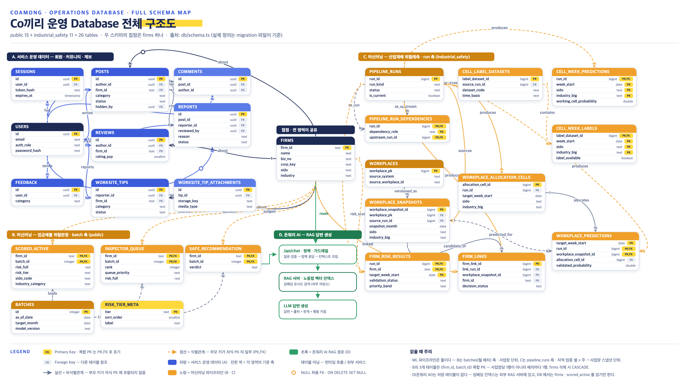

# Co끼리 운영 Database 구조도

부스 배너의 「전체 스키마 보기」 QR이 가리키는 문서다. 구조도는 영역별 관계를 보여 주고,
아래 표는 **`db/schema.ts` 기준 전체 테이블 목록**이다. 실제 정의의 정본은 `db/migrations/`
의 SQL이다.



원본(SVG가 든 HTML): [`schema-map/schema-map.html`](schema-map/schema-map.html) — 브라우저로 열면
확대해도 깨지지 않는다.

> **구조도 기준 시점**: 구조도는 26개 테이블(public 15 + industrial_safety 11)을 그린다.
> 이후 추가된 **즐겨찾기 1개(`user_favorite_firms`)와 상담 대화 기록 7개(`conversation_*`)**
> 는 구조도에 아직 없고 아래 표에만 있다. 현재 전체는 **34개**(public 23 + industrial_safety 11)다.

## 영역 요약

| 영역 | 무엇을 담나 | 기준 축 |
| --- | --- | --- |
| **접점 — `firms`** | 사업장 마스터. 모든 영역이 이 테이블 하나로 만난다 | `firm_id` |
| **A. 서비스 운영** | 회원·세션·즐겨찾기·상담 기록·커뮤니티·현장 제보 | 사용자 |
| **B. 임금체불 위험판정** | 월 배치 점수, 감독관 위험큐, 구직자 안전추천 | `batches`(월 배치) |
| **C. 산업재해 위험예측** | 지역×업종 셀·주 단위 예측과 사업장 배분 (별도 schema `industrial_safety`) | `pipeline_runs`(run) |
| **D. 돈워리 AI** | 저장 테이블 없음. 법령 벡터 인덱스는 외부 RAG 서버에 있고, DB에서는 `firms`·`scored_active` 등을 읽기만 한다 | — |

## 전체 테이블 (34)

### public — 사업장 접점 (1)

| 테이블 | 설명 | 키 |
| --- | --- | --- |
| `firms` | 사업장 마스터. 사업장명·마스킹 사업자번호·시도·업종 | PK `firm_id` |

### public — A. 서비스 운영 (17)

| 테이블 | 설명 | 키 | 구조도 |
| --- | --- | --- | :---: |
| `users` | 회원과 권한(`auth_role`) | PK `id` | ✅ |
| `sessions` | 로그인 세션. 원문 토큰은 저장하지 않고 `token_hash`만 저장 | PK `id` | ✅ |
| `user_favorite_firms` | 사용자별 즐겨찾기 사업장 | PK (`user_id`, `firm_id`) | — |
| `conversation_threads` | 상담 대화방. 삭제하면 하위 기록까지 함께 지워지는 hard delete | PK `id` | — |
| `conversation_turns` | 대화방 안의 질문·답변 한 차례. 재시도 중복 방지 키 포함 | PK `id` | — |
| `conversation_messages` | 화면에 실제로 보낸 질문과 표시된 답변 | PK `id` | — |
| `conversation_sources` | 답변에 실제로 표시된 근거만 저장(검색 후보·프롬프트는 저장 안 함) | PK `id` | — |
| `conversation_company_events` | 대화방의 선택 사업장과 각 차례 당시 사업장 연결 | PK `id` | — |
| `conversation_summaries` | 대화방의 최신 누적 요약 1개 | PK `id` | — |
| `conversation_requests` | 답변 생성 요청 기록. 완료 결과를 보관해 재시도는 재생만 한다 | PK `id` | — |
| `posts` | 커뮤니티 게시글. 상태값·카테고리·숨김 이력 | PK `id` | ✅ |
| `comments` | 게시글 댓글 | PK `id` | ✅ |
| `reviews` | 사업장 리뷰 | PK `id` | ✅ |
| `reports` | 게시글 신고 | PK `id` | ✅ |
| `feedback` | 사용자 피드백 | PK `id` | ✅ |
| `worksite_tips` | 현장 제보 | PK `id` | ✅ |
| `worksite_tip_attachments` | 현장 제보 첨부 사진 | PK `id` | ✅ |

구조도에 있던 9개와 신규 8개를 합해 17개다.

### public — B. 임금체불 위험판정 (5)

| 테이블 | 설명 | 키 |
| --- | --- | --- |
| `batches` | 적재 배치(기준일·대상 월·모델 버전) | PK `id` |
| `scored_active` | 전체 활성 사업장 점수와 39개 피처 | PK (`firm_id`, `batch_id`) |
| `inspector_queue` | 감독관 위험큐 상위 3,000곳 | PK (`firm_id`, `batch_id`) |
| `risk_tier_meta` | 위험 등급 범례·툴팁용 메타(ML팀 실측 lift 보존) | PK `tier` |
| `safe_recommendation` | 구직자 안전추천 판정 | PK (`firm_id`, `batch_id`) |

### industrial_safety — C. 산업재해 위험예측 (11)

| 테이블 | 설명 | 키 |
| --- | --- | --- |
| `pipeline_runs` | 파이프라인 실행 단위(run)와 상태 | PK `run_id` |
| `pipeline_run_dependencies` | run 사이의 상류·하류 의존 관계 | PK (`run_id`, `dependency_role`, `upstream_run_id`) |
| `cell_label_datasets` | 셀 라벨 데이터셋 | PK `label_dataset_id` |
| `workplaces` | 원천 사업장 | PK `workplace_pk` |
| `workplace_snapshots` | 사업장의 월별 스냅샷 | PK `workplace_snapshot_id` |
| `cell_week_predictions` | 지역×업종 셀 × 주 단위 예측 | PK (`run_id`, `week_start`, `sido`, `industry_big`) |
| `cell_week_labels` | 셀 × 주 단위 라벨 | PK (`label_dataset_id`, `week_start`, `sido`, `industry_big`) |
| `workplace_allocation_cells` | 셀 예측을 사업장에 배분하는 단위 | PK `allocation_cell_id` |
| `workplace_predictions` | 사업장 단위 예측(분기 파티션) | PK (`target_week_start`, `run_id`, `workplace_snapshot_id`) |
| `firm_risk_results` | `firms`와 검증된 연결이 있는 산업재해 결과만 보존 | PK (`run_id`, `firm_id`, `target_week_start`) |
| `firm_links` | 산재 원천 사업장 ↔ `firms` 연결 후보와 판정 | PK `firm_link_id` |

## 합계

| schema | 구조도에 있음 | 구조도에 없음 | 계 |
| --- | ---: | ---: | ---: |
| public | 15 | 8 (`user_favorite_firms`, `conversation_*` 7) | 23 |
| industrial_safety | 11 | 0 | 11 |
| **계** | **26** | **8** | **34** |

## 갱신 방법

1. `schema-map/schema-map.html`의 SVG를 고친다.
2. 헤드리스 Chrome으로 2배 해상도 PNG를 다시 뽑는다.

   ```bash
   "/Applications/Google Chrome.app/Contents/MacOS/Google Chrome" --headless=new \
     --hide-scrollbars --force-device-scale-factor=2 --window-size=2000,1252 \
     --screenshot=schema-map.png "file://$PWD/db/docs/schema-map/schema-map.html"
   ```

3. 위 전체 테이블 표를 `db/schema.ts`와 대조한다.
