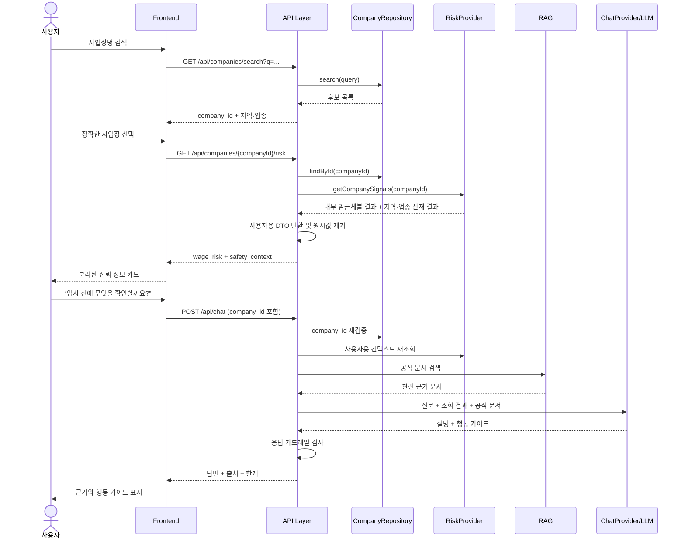
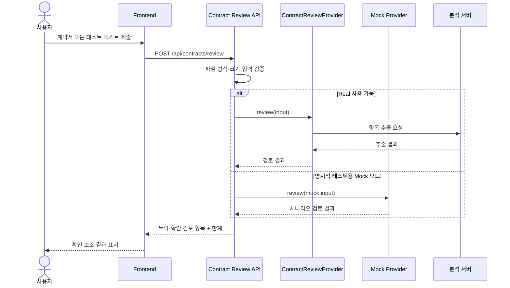

# 돈워리 통합 프로토타입 시스템 아키텍처

- 문서 상태: Final v2
- 기준일: 2026-08-11

## 1. 설계 목표

통합 프로토타입의 실행 기본값은 실제 ML 운영 DB, RAG, LLM, 계약서 분석 시스템이다. UI, API, 어댑터,
외부 시스템은 분리하며 Mock 구현은 단위 테스트와 별도 정적 시연본 검증 용도로만 보존한다.

핵심 원칙은 다음과 같다.

- 공개 API의 `company_id`는 PostgreSQL `firms.firm_id`와 동일한 값이다.
- 임금체불 신호와 산업재해 맥락은 결합하지 않는다.
- 산업재해 결과는 `region_industry | validated_firm_context` 범위의 `safety_context`로 다루며 사고 확률로 해석하지 않는다.
- 내부 모델 값과 사용자용 응답 DTO를 분리한다.
- LLM은 DB 결과를 재계산하거나 추정하지 않고 설명만 한다.
- Real 공급자 실패는 명시적 오류가 되며 자동으로 Mock 성공 결과로 전환하지 않는다.

## 2. 전체 구조

```mermaid
flowchart TB
    subgraph FE[Frontend]
        LANDING[랜딩 페이지]
        SEARCH[사업장 검색 화면]
        DETAIL[사업장 상세 화면]
        WAGE[임금체불 신뢰 정보 카드]
        SAFETY[산업재해 공표 우선순위 카드]
        CHAT[챗봇 UI]
        CONTRACT[근로계약서 업로드·검토 UI]
    end

    subgraph API[Backend / API Layer]
        SEARCH_API[Company Search API]
        RISK_API[Company Signal API]
        CHAT_API[Chat API]
        CONTRACT_API[Contract Review API]
        DTO[Public DTO Mapper / Policy Guard]
    end

    subgraph ADAPTER[Adapter Layer]
        MCR[MockCompanyRepository]
        RCR[RealCompanyRepository]
        MRP[MockRiskProvider]
        MLP[MlRiskProvider]
        MCP[PolicyChatProvider]
        RCP[RealChatProvider]
        MCON[MockContractReviewProvider]
        RCON[RealContractReviewProvider]
    end

    subgraph EXT[External Systems]
        MLDB[(ML 운영 DB)]
        PROMPT[프롬프트·LLM 서버]
        RAG[(RAG 서버 / Vector DB)]
        DOC[계약서 분석 서버]
    end

    SEARCH --> SEARCH_API
    DETAIL --> RISK_API
    DETAIL --> WAGE
    DETAIL --> SAFETY
    CHAT --> CHAT_API
    CONTRACT --> CONTRACT_API

    SEARCH_API --> MCR
    SEARCH_API --> RCR
    RISK_API --> MRP
    RISK_API --> MLP
    CHAT_API --> MCP
    CHAT_API --> RCP
    CONTRACT_API --> MCON
    CONTRACT_API --> RCON

    RCR --> MLDB
    MLP --> MLDB
    RCP --> PROMPT
    RCP --> RAG
    RCON --> DOC

    SEARCH_API --> DTO
    RISK_API --> DTO
    CHAT_API --> DTO
    CONTRACT_API --> DTO
    DTO --> FE
```



브라우저가 호출하는 공개 API의 주인은 Next.js 하나다. RAG는 답변을 생성하지 않고 검색 근거만 반환하며,
Next.js가 그 근거를 두 LLM에 동일하게 전달한다. DB 조회는 읽기 전용 계정과 read-only 세션으로 제한한다.

## 3. Frontend

### 랜딩 페이지

- 서비스 목적과 한계를 짧게 설명한다.
- 구직자·근로자가 사업장 검색 또는 노동 상담으로 진입하게 한다.
- “안전 판정”, “위험 확률 제공” 같은 표현을 사용하지 않는다.
- 기존 Figma 추출물의 색상·간격·타이포그래피는 참고하되 정책과 충돌하는 문구는 재사용하지 않는다.

### 사업장 검색 화면

- 검색어를 Company Search API로 전달한다.
- 동명이인 후보마다 현재 DB에 존재하는 지역, 업종과 매칭 방식을 표시한다. 주소·규모는 소비자 기능에서 제외한다.
- 검색 결과는 전체 일치 건수를 계산하고 10개씩 페이지를 이동한다.
- 후보 선택 후 URL이나 화면 상태에는 `company_id`를 저장한다.
- 사업장명만으로 자동 확정하지 않는다.

### 사업장 상세 화면

- 선택한 사업장의 식별 정보와 데이터 기준일을 표시한다.
- 임금체불 카드와 산업재해 맥락 카드를 독립적으로 렌더링한다.
- 한 카드의 실패나 `unknown`이 다른 카드 렌더링을 막지 않게 한다.
- 임금과 산업안전 공급자를 독립 호출해 한쪽의 장애가 다른 카드의 결과를 지우지 않게 한다.
- 공식 명단 등재 사실을 모델 신호와 별도 영역에 표시한다.

### 임금체불 신뢰 정보 카드

- `normal | watch | review | unknown` 상태를 설명형 문구로 표시한다.
- 근거 항목, 데이터 충분도, 공식 명단 상태, 기준일과 출처를 제공한다.
- 확률, 백분위, SHAP 값은 받지도 렌더링하지도 않는다.

### 산업재해 확인 신호 카드

- API의 `safety_context`를 사용한다.
- `scope=region_industry`면 대상 지역·업종을, `scope=validated_firm_context`면 검증된 사업장 연결임을 명시한다.
- `validated_firm_context`도 공표 우선순위이며 검증된 사업장 사고 확률이 아님을 표시한다.
- 개별 사업장의 사고 가능성으로 해석할 수 있는 문구를 금지한다.
- `unknown`이면 카드 껍데기는 유지하고 “분석 가능한 자료가 부족합니다”만 표시한다.

### 챗봇 UI

- 일반 상담과 회사 컨텍스트 상담을 같은 대화 UI에서 제공한다.
- 회사가 선택되면 현재 `company_id`와 사용자용 신호 결과를 서버에 전달한다.
- 출처, 권장 행동, 한계, 가드레일 상태를 답변과 함께 표시한다.
- 위급한 산업재해 표현이 감지되면 일반 설명보다 긴급 대응 안내를 우선한다.

### 근로계약서 업로드·검토 UI

- 파일 또는 테스트 텍스트를 받는다.
- 누락 항목, 확인된 항목, 추가 검토 항목, 경고, 사용자 질문 예시를 구분한다.
- Mock/Real 여부를 개발·시연 환경에서만 확인할 수 있게 한다.
- 문서 분석 실패가 검색·상세·챗봇 상태에 영향을 주지 않게 별도 오류 경계를 둔다.

## 4. Backend / API Layer

### Company Search API

- 경로: `GET /api/companies/search?q={query}`
- 검색어 정규화와 길이 검증을 수행한다.
- Repository의 내부 행을 사용자용 검색 결과로 변환한다.
- 빈 검색 결과는 정상적인 빈 목록으로 반환한다.

### Company Signal API

- 경로: `GET /api/companies/{companyId}/risk`
- 경로 이름은 기존 통합 프롬프트와의 호환을 위해 유지한다.
- 응답 내부에서는 `wage_risk`와 `safety_context`를 명확히 분리한다.
- 회사 존재 여부와 분석 데이터 존재 여부를 구분한다.
- 내부 원시값을 Public DTO Mapper에서 제거한다.

### Chat API

- 경로: `POST /api/chat`
- 입력을 검증하고 필요하면 `company_id`로 서버에서 회사 컨텍스트를 다시 조회한다.
- 클라이언트가 보낸 회사 설명을 신뢰해 모델 결과로 사용하지 않는다.
- RAG 검색 결과와 공식 출처만 LLM 컨텍스트로 전달한다.
- 프롬프트 가드레일과 응답 후처리 가드레일을 모두 적용한다.

### Contract Review API

- 경로: `POST /api/contracts/review`
- 실제 파일, 테스트 텍스트, Mock 파일 메타데이터 중 하나를 받는다.
- 파일 추출 결과를 직접 법률 판정으로 변환하지 않는다.
- 실제 공급자 오류는 명시적 계약 분석 오류로 반환하며 Mock 성공 결과로 바꾸지 않는다.

## 5. Adapter Layer

### Company Repository

```ts
interface CompanyRepository {
  search(query: string, limit: number): Promise<CompanySearchRecord[]>;
  findById(companyId: string): Promise<CompanyRecord | null>;
}
```

- `MockCompanyRepository`: 본선 시나리오용 고정 사업장과 동명이인 후보 제공
- `RealCompanyRepository`: 운영 DB 또는 확정된 사업장 테이블 조회

### Risk Provider

```ts
interface RiskProvider {
  getCompanySignals(companyId: string): Promise<InternalSignalResult | null>;
}
```

- `MockRiskProvider`: `normal`, `watch`, `review`, `unknown`, 만료 상태 제공
- `MlRiskProvider`: 운영 DB에서 저장된 결과를 읽음
- 두 구현 모두 최종적으로 동일한 Public DTO로 변환됨

### Chat Provider

현재 프로토타입은 `DualLlmChatProvider`가 Upstage Solar와 SKT A.X의 OpenAI 호환 Chat Completions API를 같은 조건으로 병렬 호출한다. `PolicyChatProvider`는 최종 사용자 답변 생성기가 아니라, 회사 선택·긴급상황·근거 부족·금지 표현에 대한 정책 기준과 fallback 문구를 제공한다.

- 공유 키 파일은 서버에서만 읽고 클라이언트 번들에 포함하지 않는다.
- 한 모델이 실패해도 다른 모델 결과는 유지한다.
- 모델 출력은 금지 표현 후처리를 거치며 위반 시 정책 기준 문구로 교체한다.
- UI에는 지연시간·토큰·종료 사유·가드레일 상태를 표시하되 숨은 프롬프트와 API 키는 표시하지 않는다.
- 비교 선택 로그에는 질문·답변 원문을 저장하지 않는다.

일반 사용자 `/api/chat`은 `CHAT_EXECUTION_MODE` feature flag로 두 실행기를 선택한다. 기본 `dual_api`는
위 동작을 그대로 보존한다. `openai_responses`는 기존 PolicyChatProvider의 긴급·fallback 기준을 유지한 채
다음 서버 경계를 추가한다.

```text
ResponsesChatService
  → OpenAIResponsesClient (raw /v1/responses)
  → OpenAIResponsesRunner (function_call 반복·한도·usage 합산)
  → allowlist ToolDispatcher
      ├─ search_company       → companyService
      ├─ get_company_risk     → riskService
      ├─ retrieve_labor_law   → ragService
      └─ review_contract      → contractService + request-scoped File
```

도구 handler는 Repository나 외부 adapter를 새로 구현하지 않고 기존 service를 주입받는 얇은 경계다.
모델은 임의 SQL·URL·파일 경로를 실행할 수 없다. strict JSON schema 다음에 런타임 parser와 dispatcher
allowlist를 다시 거치며, service가 공개한 `ServiceError` 외 내부 오류 원문은 function output에 넣지 않는다.

Responses loop는 stateless 요청에서 reasoning item을 포함한 `response.output` 전체와 동일한 `call_id`의
`function_call_output`을 다음 입력으로 돌려준다. 동일 call ID 재실행 방지, 다른 인자의 call ID 재사용 차단,
계약 검토 run당 1회, 전체 도구 호출·라운드·실행시간 제한을 적용한다. 실제 RAG citation/source만 ledger에
누적해 최종 출력의 법령 인용 가드레일과 사용자 출처에 사용한다.

```ts
interface ChatProvider {
  answer(input: ChatProviderInput): Promise<ChatProviderResult>;
}
```

- `PolicyChatProvider`: 긴급상황과 정책 위반 시 사용할 결정적 기준 안내 제공
- `DualLlmChatProvider`: 서버 질의 재작성, RAG 검색 결과를 이용한 병렬 생성과 후처리 가드레일 수행
- LLM 공급자 선택은 Provider 내부 설정이며 API 계약에는 노출하지 않음

### Contract Review Provider

```ts
interface ContractReviewProvider {
  review(input: ContractReviewInput): Promise<ContractReviewResult>;
}
```

- `MockContractReviewProvider`: 파일 분석 없이 테스트 결과 반환
- `RealContractReviewProvider`: 문서 추출 API와 검토 로직 호출
- 한별 팀원의 기존 `/check-contract` 구현은 Real Adapter 안에서 호출하거나 로직을 이식할 수 있음

## 6. External Systems

### ML 운영 DB

- `company_id`를 조회 키로 사용한다.
- 임금체불 사용자 공개 판정과 산업재해 공표 우선순위를 분리 저장한다.
- `data_as_of`, `generated_at`, `valid_until`, 모델·데이터 버전을 보존한다.
- 운영 PostgreSQL의 `firms`, `batches`, `scored_active`, `safe_recommendation`과 허용된
  `industrial_safety.v_llm_firm_safety_context`만 읽는다.
- 구직자 응답은 `safe_recommendation.판정`을 사용하고, 공개 `/api/companies/*`에는 감독관 전용
  `grade`·`risk_full`·SHAP를 노출하지 않는다.
- 팀 시연용 `/api/inspector/*`만 최신 `inspector_queue`와 `scored_active`의 내부 필드를 읽는다.
  `risk_full`은 상대 모델 원점수로 표시하고 확률화하지 않으며, 시연 서버에서는 Basic 인증을 필수로 한다.
- 감독관 챗봇이 사업장 내부 컨텍스트를 외부 LLM에 전달하려면 화면과 API 양쪽에서 명시적 확인이
  필요하다. 화면은 사업장·배치·ML·관측지표·산업안전·RAG 범위를 접기/펼치기로 안내하고,
  외부 컨텍스트에서는 `firm_id`와 마스킹 사업자번호를 제거한다.
- DB에 없는 주소·규모·미확정 기준월은 `null`로 유지한다.

### 프롬프트·LLM 서버

- 질의 재작성과 최종 답변 생성을 분리할 수 있다.
- 회사 결과를 재계산하거나 다른 회사 데이터를 섞지 않는다.
- 공급자별 차이는 어댑터 내부에서 흡수한다.
- 일반 상담과 감독관 상담은 사용자 입력·대화 이력·검색 문서를 지시가 아닌 데이터로 취급한다.
- 법령은 이번 RAG 검색에 직접 연결된 조항만 문장 안에 인용한다. 검색 실패 시 조문을 생성하지 않고
  근거 부족과 공식 확인 경로를 짧게 안내한다.
- 기간·금액·비율을 근거 없이 만들거나 계산하지 않으며, 결론 → 확인된 근거 → 행동 → 한계 순으로 답한다.
- 계약서 분석 서비스의 프롬프트·가드레일은 `integrations/contract-api`에 보존된 CSH 규칙 세트를 사용하고,
  일반·감독관 상담은 별도의 TypeScript 출력 가드레일로 공개 위험값·단정·지침 유출을 차단한다.

### RAG 서버

- 법령, 신고 절차, 대지급금, 1350, 산업안전 행동 안내 등 공식 문서만 검색 대상으로 삼는다.
- 검색 결과가 없거나 유사도가 낮으면 LLM 호출을 생략하거나 제한 응답을 생성한다.
- 검색 결과에는 문서명, 기관, 문서 URL 또는 식별자, 기준일을 포함한다.

### 계약서 분석 서버

- 문서에서 기본 항목 후보를 추출한다.
- 추출 결과는 검토 보조 입력이며 법적 효력이나 위법 여부를 확정하지 않는다.
- 원문과 추출 텍스트의 저장 여부는 운영 전에 개인정보 정책을 별도로 확정한다.

## 7. 사업장 검색·상담 데이터 흐름



## 8. 계약서 검토 데이터 흐름



## 9. 사용자용 DTO 경계

외부 시스템의 응답을 프론트엔드에 그대로 전달하지 않는다. API Layer는 다음 두 타입을 분리한다.

- `InternalSignalResult`: 원시 확률, 백분위, SHAP 값, 모델 버전 등 내부 운영 정보 포함 가능
- `PublicCompanySignalResponse`: 등급, 설명, 근거 코드, 데이터 충분도, 기준일, 출처만 포함

Public DTO 변환 후 금지 필드가 남아 있으면 요청을 실패시키거나 서버 로그에 정책 위반으로 기록한다. 정적 Mock 데이터도 같은 변환기를 거쳐 브라우저 번들에 내부값이 포함되지 않게 한다.

## 10. 실패 격리와 실행 모드

기능별로 독립적인 공급자 모드를 둔다.

```text
COMPANY_PROVIDER=mock | real
RISK_PROVIDER=mock | ml
CHAT_PROVIDER=mock | real
CONTRACT_PROVIDER=mock | real
```

권장 초기값은 전부 `mock`이다. Real 전환은 해당 외부 시스템의 상태 점검과 시나리오 테스트를 통과한 뒤 한 기능씩 수행한다.

외부 장애 시 원칙은 다음과 같다.

- 사업장 검색 실패는 이전 실제 조회 결과와 구분되는 오류 상태로 표시한다.
- 임금체불 데이터가 없어도 산업재해 카드를 렌더링하고 그 반대도 동일하다.
- RAG 실패 시 일반 상식으로 법률 답변을 채우지 않는다.
- LLM 실패 시 검색·카드·출처 링크는 계속 사용할 수 있다.
- 계약서 분석 실패는 계약 기능 내부 오류로만 표시한다.

## 11. 기존 팀 자산과 통합 위치

| 자산 | 활용할 부분 | 그대로 사용하지 않을 부분 |
|---|---|---|
| Figma 추출물·정적 랜딩 | 색상, 간격, 타이포그래피, 섹션 구성 | 위험 확률, 사용자 정책과 충돌하는 문구 |
| 성현 정적 프로토타입·모델 비교 | 신뢰 정보 카드의 계층, 챗봇 가드레일·평가 아이디어 | 브라우저에 포함된 원시 산재 값, 커뮤니티를 핵심으로 둔 구조 |
| 한별 Flask RAG·계약 검토 | 공식 법령 검색, 계약 필수항목, 실제 Provider 어댑터 | 기존 경로·응답을 통합 API로 직접 노출하는 방식 |
| 승석 Next.js 웹 | TypeScript 도메인 타입, Mock CSV 분리, 오류 문구 | 구직자 위험 퍼센트, 안전 확정 표현, 감독관·사업주·커뮤니티 중심 범위 |
| 공용 원천 데이터 | 향후 운영 DB와 검색 인덱스 생성의 입력 | 프론트엔드가 원천 CSV를 직접 읽는 구조 |

다른 팀원 파일은 읽기 전용 참고 자료다. 통합 코드와 새 문서는 `/data/shared-SeD/jcu0304/2nd_Side2026_Project` 안에서만 작성한다.
